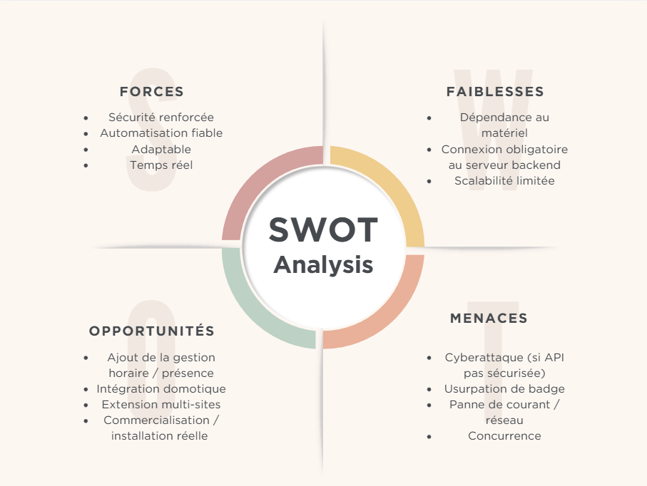

# Module 306 : Réaliser un projet informatique  
## Business case 📝

---

## **Business case : Nom du projet**

### **Réalisé par :**
- Nom Prénom  
- Nom Prénom  
- Nom Prénom  
- Nom Prénom  

---

## **Table des matières**
1. [Contexte du projet](#1-contexte-du-projet)  
2. [Problématique / Opportunité](#2-problématique--opportunité)  
3. [Objectifs du projet](#3-objectifs-du-projet)  
4. [Bénéfices attendus](#4-bénéfices-attendus)  
5. [Analyse SWOT](#5-analyse-swot)  
6. [Parties prenantes](#6-parties-prenantes)  
7. [Risques principaux](#7-risques-principaux)  
8. [Budget estimé](#8-budget-estimé)  
9. [Critères de succès](#9-critères-de-succès)  
10. [Décision GO / NOGO](#10-décision-go--nogo)  

---

## **1. Contexte du projet**
Décris brièvement la situation actuelle, le problème identifié ou l’opportunité.  
Explique pourquoi ce projet est pertinent dans ce contexte.

---

## **2. Problématique / Opportunité**
Précise le besoin ou le défi à relever.  
Qu’est-ce qui motive le lancement du projet ?  
Quelle valeur ajoutée est attendue ?

---

## **3. Objectifs du projet**
Résume les objectifs principaux du projet.  
Les objectifs doivent être **SMART**.

---

## **4. Bénéfices attendus**
Explique les avantages que le projet apportera une fois terminé :  
- gains de temps  
- amélioration de qualité  
- satisfaction client  
- etc.

---

## **5. Analyse SWOT**

---

## **6. Parties prenantes**
Liste les personnes ou groupes impliqués dans le projet :  
- client  
- utilisateurs  
- équipe projet  
- etc.  
Indique leur rôle.

---

## **7. Risques principaux**
Identifie les risques majeurs pouvant impacter le projet :  
- techniques  
- humains  
- organisationnels  
Explique comment ils pourraient être atténués.

---

## **8. Budget estimé**
Donne une estimation des ressources nécessaires :  
- temps  
- matériel  
- compétences  
Même si ce n’est pas un budget financier réel.

---

## **9. Critères de succès**
Décris comment on saura que le projet est réussi :  
- livrables validés  
- respect des délais  
- satisfaction du client  
- etc.

---

## **10. Décision GO / NOGO**
Conclue avec une recommandation : le projet doit-il être lancé ?  
Justifie la décision selon les éléments précédents.
